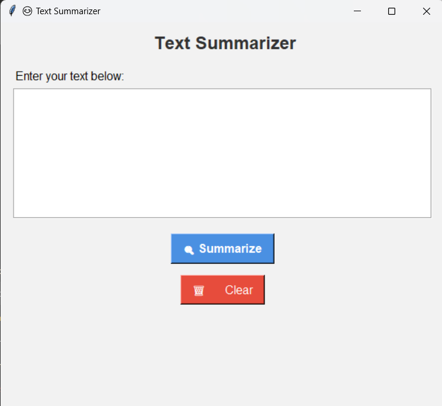
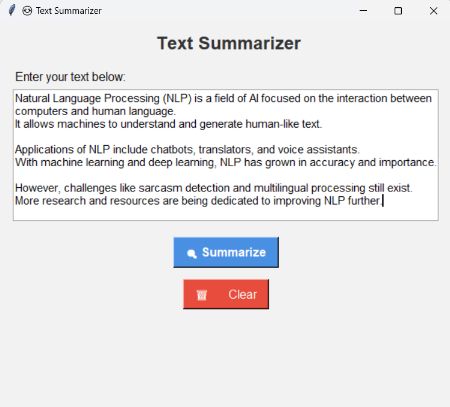
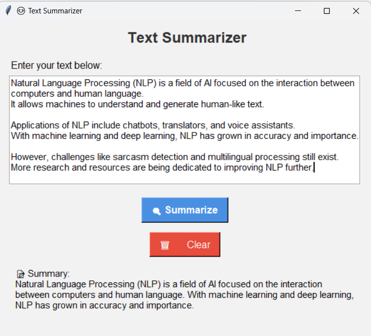

# NLP Text Summarizer

## Overview

This project is a Python-based NLP Text Summarizer that generates concise summaries from lengthy text using Natural Language Processing techniques.

## Features

* Automatic text summarization
* Frequency-based sentence ranking
* Stop-word removal
* User-friendly Tkinter GUI
* Clear and summarize functionality

## Technologies Used

* Python
* NLTK
* Tkinter

## Installation

```bash
pip install nltk
```

Download required NLTK resources:

```python
import nltk
nltk.download('punkt')
nltk.download('stopwords')
```

## Run the Project

```bash
python main.py
```

## Project Structure

NLP-Text-Summarizer/
│
├── main.py
├── requirements.txt
├── README.md
└── screenshots/

## Screenshots

### Home Screen


### Input Text


### Generated Summary


## Author

Priyanshi Gupta
